# Cashflow Companion: a budgeting app

'Cashflow Companion' is a command-line-interface (CLI) budgeting app hosted as an app on Heroku, written in Python.

## Purpose 
The objective of this app is to provide the user with a means to set up a personalised monthly budget with their own budget names, budget amounts and expense entries. It will provide a trio of useful reports including one showing the user how their expenditure is tracking over the month, informed by how much of their budget they've spent and how far through the month they are.

## Requirement Gathering and Planning

Before starting the coding for this project, I took the time to think about how to set up the architecture of this app, the layout of the output on the console and the functionality required to provide a good user experience. 

### User Demographics, Stories and Needs

#### Target Demographic
This app is useful for anyone wanting to track and control their finances regardless of age, income or profession. Some examples of such people are: 

- Students: this group of people tend to be younger, have a smaller budget and just starting to manage their own finances. Keeping track to avoid overspending would be useful to them.
- Families: multiple adults working from a single budget with a wide variety of expenses including childcare, may need to keep a close eye on their finances to ensure that their outgoings don't exceed their income.
- Debt repayers: people who are trying to actively reduce their debt such as student loans or credit card debts, benefit from the use of this app because they can manage their spending to ensure they have enough for a payment against their debt at the end of the month.

#### User Stories

There were quite a few user stories for this app so to make them more readable and avoid repetition, I have compiled them in the table below. 

|As a budget app user, I want to... | So that... |
|--------|--------|
| ...create budgets and assign them amounts. | ...I can personalise what types of expenses I'm tracking and how much I've got set aside for each budget. |
| ...see which budgets I have and the amounts assigned to them. | ...I am reminded of how much I can spend in any given budget.|
| ...change the budgets and/or amounts allocated to them. | ...my budgeting is flexible should my circumstances or priorities change. |
| ...delete a budget. | ...I can remove any budget that is no longer relevant to my budgeting activities. |
| ...add new expenses. | ...I can keep track of all of them against my budget for each budget. |
| ...update the name and amount of an existing expense. | ...I can correct any typos or update the cost if it changes. |
| ...delete expenses from any budget. | ...I can keep my outgoings figures correct in the case of a return or refund. |
| ...read all expenses in a budget. | ...I can review my expenses for this month in any given budget. |
| ...read the last 3 expenses for each budget. | ...I can review my recent purchases across all budgets. |
| ...get a summary of all expenses. | ...I can see the full picture of all my expenses for the month. |
| ...get a report for my overall spending indicating the budgets that are under/over budget. | ...I know whether I am on track to meet my budget goals this month. |
| ...have the option of going back one step wherever I am. | ...I have freedom to navigate back if I've accidentally chosen the wrong option or changed my mind. |
| ...have a clear and intuitive method of navigating through the app via the command line. | ...I can easily navigate and use the app. |

### Process Flowchart 

I created this flowchart to think about the various paths through the app from the command line and what the user journeys would look like. Please open the chart full width or use the zoom function in GitHub to see the information.

There are two more details regarding the user journeys that I have omitted from the flowchart so as not to crowd it and make it illegible: 
- At the end of each journey the user will be automatically returned home(to the start of the flowchart), apart from on the expense arm of the flowchart where the user will be returned to the budget choice menu instead. 
- At each input the user will also have the option to go to the main menu.

--------------------------

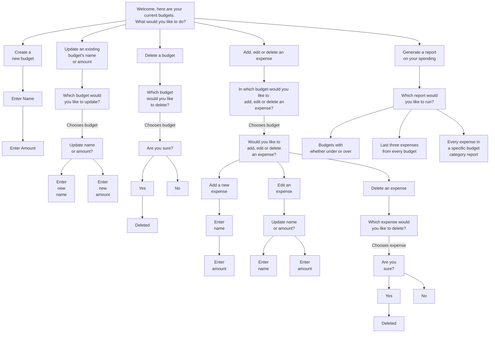

### Data Model

The data model and the use of 'CRUD' operations are central to the functioning of this CLI app. The data is stored in a Google Sheet and is not lost between sessions. 

#### Google Sheet Data Structure
- The overall spreadsheet stores the data for the whole app
- Each budget has its own dedicated worksheet within the spreadsheet

- For each budget worksheet:
    - The title on the tab is the name of the budget
    - The name of this budget is also the only data in the top row.
    - The second row has the running total for the expenses on that worksheet - e.g. 'Running Total | 250.00'
    - The third row has the amount allocated to this budget - e.g. 'Amount Budgeted | 400.00'
    - The fourth row onwards holds all the expenses, one expense per row - e.g. 'Eggs | 2.00', 'Yoghurt | 1.75'

- The data is accessed via the 'gspread' API with a variety of call types to read and write data from and to the spreadsheet.

#### App Data Structure
- There are two major types of data in this app: budgets and expenses. 
- Budgets are uniquely named and have their associated allocated amounts and running totals.
- Expense names may be repeated and have their associated amounts.
- Expenses are assigned to budgets and it is not possible to have an orphaned expense.
- The predominant data collection type in the app is lists. These provide the most flexibility and specificity as they are ordered, mutable, indexed and allow duplicates.

#### Data Manipulation
- Data is created, read, updated and deleted as per the 'CRUD' operations model. 
- It is retrieved from and written to the Google Sheet.
- The writing of new data is always derived from user input. 

#### Error Handling 
- There are 9 exceptions built into gspread. I have detailed them in the table below and explained the reasoning behind which ones were actively handled and which were left to be handled more generically. 

|Exception Type | Handled Specifically? | Reasoning |
|--------|--------|--------|
| gspread.exceptions.APIError(response) | Yes | This is the most likely to occur and I have handled two codes pertaining to this specifically: '429' when the API call quota is exceeded and '400' when the user attempts to name a budget the same name as an existing budget - as these are the most likely to occur within this exception type.|
| gspread.exceptions.CellNotFound | No | Through testing I have assured that only cells with values are accessed.|
| gspread.exceptions.GSpreadException | No | I considered handling this one as the generic exception for gspread-related exceptions, but I decided it was better to handle the remainder in an even more generic way, using 'except Exception'. This catches non-gspread-related exceptions too.|
| gspread.exceptions.IncorrectCellLabel | No | Through testing I have assured the cell label values point to the correct labels.|
| gspread.exceptions.InvalidInputValue | No | Validation is handled in the app itself. The Google Sheet doesn't mind what data you provide.|
| gspread.exceptions.NoValidUrlKeyFound | No | This would be overengineering considering there is one sheet and the credentials are not changing.|
| gspread.exceptions.SpreadsheetNotFound | No | This would be overengineering as there is only one spreadsheet that is hooked up to the app and will not change.|
| gspread.exceptions.UnSupportedExportFormat | No | There is no exporting in my app.|
| gspread.exceptions.WorksheetNotFound | No | There is no searching for a specific worksheet - they are printed afresh each time to allow the user to select one.|

Of course it is possible that some of the exceptions I have chosen to not handle individually will occur - in this case my generic exception handling will pick this up, advise the user that something went wrong and return them to the main menu to try again. If this were a real-world application, my decisions would be tested when many users used the app and changes to the exception handling could be made if any of my assumptions proved incorrect. I believe this would be a good starting point balancing possible scenarios with the right level of engineering.

All exceptions are handled in a central API-calling function that is called from the various places in the code that need to read or write data from or to the spreadsheet.

#### Validation
- There are different types of validation depending on the user input type: 

1. Menu Choice Validation 
    - This checks whether the user has entered the correct format of input(letter or number depending on the menu)
    - This also checks that they chosen an available option
2. Budget Name Validation
    - This checks whether the name is between 1 and 15 characters
    - This also checks whether this name is already taken by an existing budget
3. Expense Name Validation
    - This checks whether the name is between 1 and 15 characters
4. Amount Number Validation
    - This checks whether the input is a positive number
5. Number of Budgets Validation
    - This validation enforces a maximum 20 budgets limit when a user attempts to create a new one.

There is also one type of generic validation for all input fields: no blank values.

## Design

### Wireframes
I wrote text-based wireframes to plan what will be in the console for each scenario prior to starting development. I also adjusted them as I went and ensured their accuracy at the end as I had made changes during the development process. These are included in a separate file [here](wireframes.md)

During design and when changes were made, I considered whether enough of the lines I print for each part of the app, fit onto a terminal of 80 characters wide and 24 rows high. The aim was to reduce or ideally eliminate the potential for user confusion or excessive scrolling. 

## Features
The features of the app can be grouped into four main areas: 

1. Main Menu
2. Budgets
3. Expenses
4. Reports

The branches coming off the root of my flowchart above, make up these three main areas. Whereas my process flowchart above is from the perspective of user journeys, the flowcharts below lay out the logic path through the app for each feature, from home to achieving the desired outcome.

The 'read' element of the CRUD framework is presented automatically to the user at each appropriate moment:
- Budgets are shown in a list as soon as the app is run, and any time the user returns to the main menu.
- A specific budget with its expenses are shown when a budget is chosen in the expenses part of the app
- Budgets and expenses are shown in three different ways when the three different reports are run:
    - Under/Over Report: this shows each budget's name, running total and allocated amount with the percentage of the budget spent so far and the under/over/spot on value. No expenses are shown in this report.
    - Last Three Report: this shows each budget's name, running total and allocated amount with the last three expenses in each budget to give an overview of the most recent expenses in each.
    - Every Expense Report: this shows one budget's name, running total and allocated amount with all expenses in that budget listed below. 

Screenshots of each feature are provided below each flowchart.

---

### Main Menu
The main menu is what is shown when the app is first run and anytime the user is returned home. It provides a menu of all the possible paths through the app, including to the expense sub-menu. The logical path through the main menu is the same as the top two rows of the journey flowchart, with the addition of validation of the user's input. This validation checks that the input provided is one of the available choices (see validation section of data model for further information).

#### Main Menu Screenshot
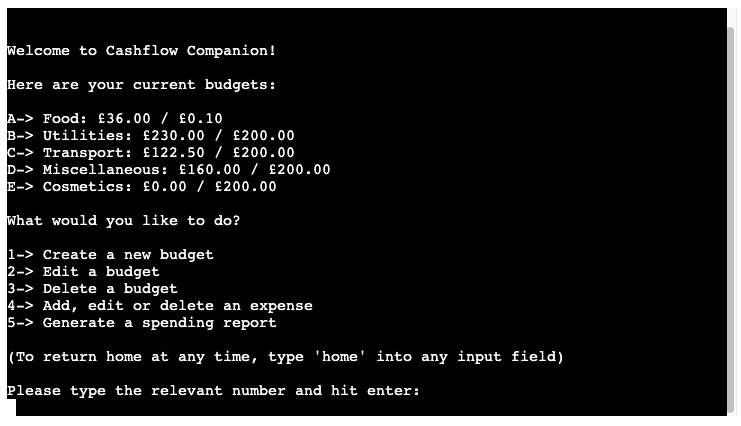

---

### Budgets
All budget actions can be accessed directly from the first part of the app, selecting options 1, 2 or 3. Here are the logic paths through the app for each budget feature.

#### Create a budget 
This is option one when the app is run. Due to the way the system is set up, it is not possible to validate the name input prior to asking for the amount input. This is listed as a possible future improvement in the 'Future Features' section below. 

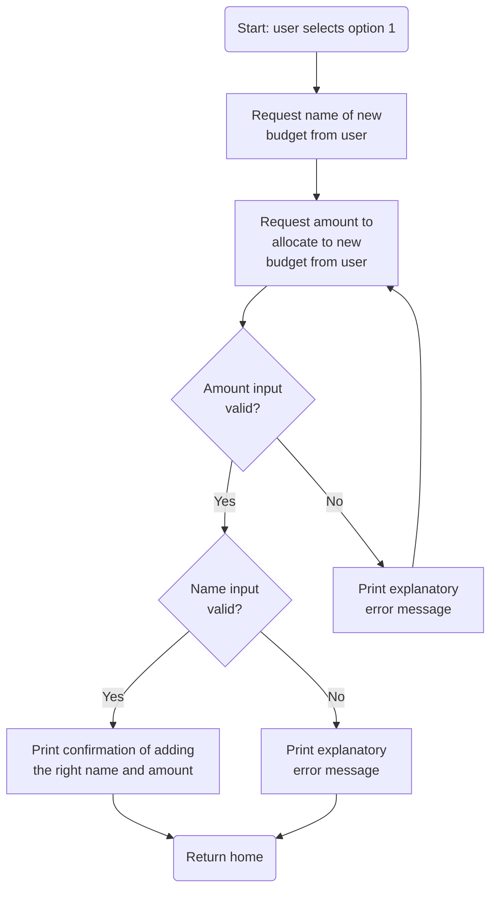
##### New Budget Screenshot
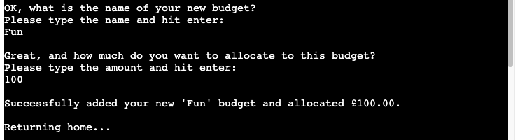

---

#### Edit a budget
This is option two when the app is run. 

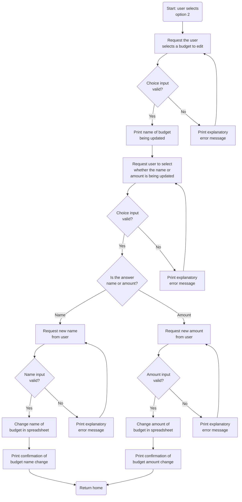
##### Edit Budget Screenshot
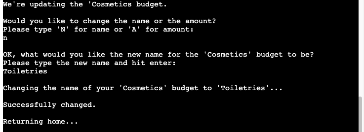

---

#### Delete a budget
This is option three when the app is run. 

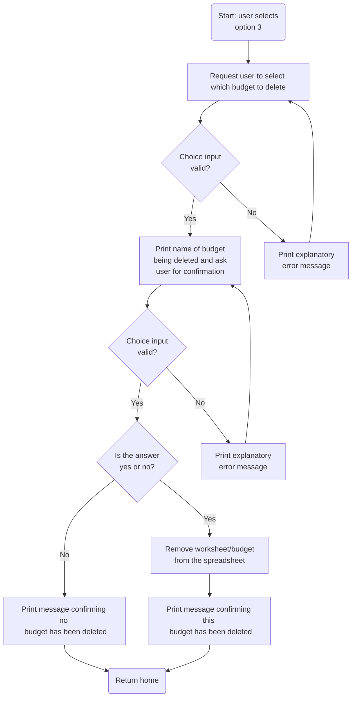

##### Delete Budget Screenshot
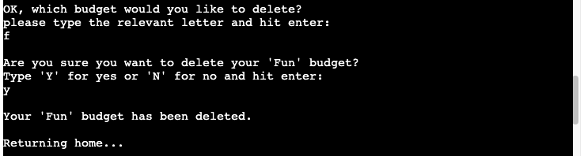

---

### Expenses
All expense actions are accessed from main menu option 4 when the app is run. 

#### Expense Menu
The expense menu is what is shown when option 4 is selected in the main menu and anytime the user is returned to the expense menu after completing an expense action. In the latter scenario of being returned to this menu, the list of budgets is also printed again to remind the user and prevent excessive scrolling up to see this list from when it was originally printed. In this menu, the user is first asked which budget they want to access for expense purposes, then which expense action they want to carry out in that budget and are given the options A - to add an expense, B - to edit an expense and C - to delete an expense. In the event that there are no existing expenses in the budget chosen, the user is skipped automatically to adding an expense (option A).

##### Expense Menu Screenshot
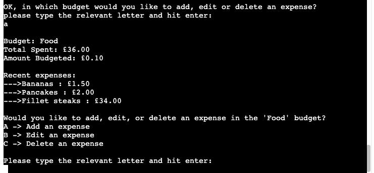

---

#### Add an expense
This is option A after a budget has been chosen in the expenses menu.

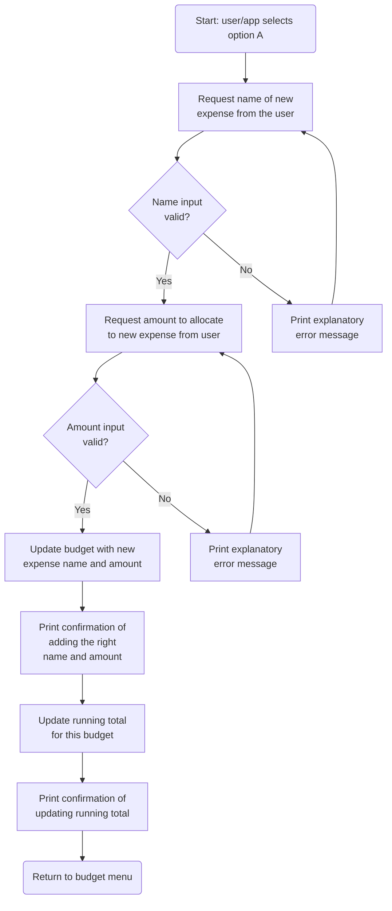

##### Add Expense Screenshot
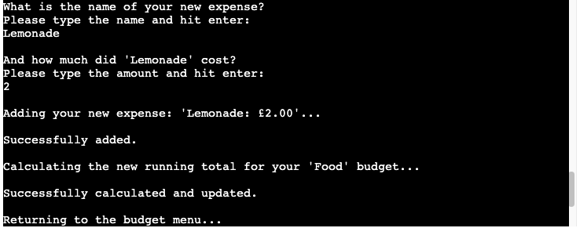

---

#### Edit an expense
This is option B after a budget has been chosen in the expenses menu.

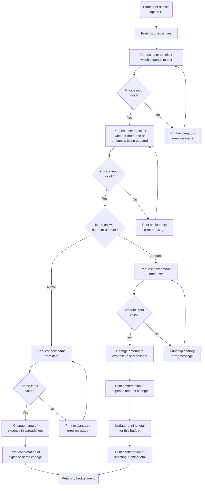
##### Edit Expense Screenshot
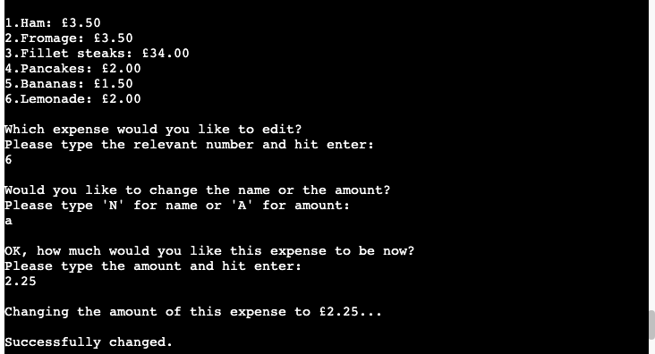
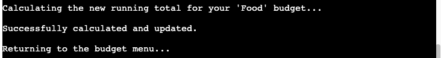

---

#### Delete an expense
This is option C after a budget has been chosen in the expenses menu.

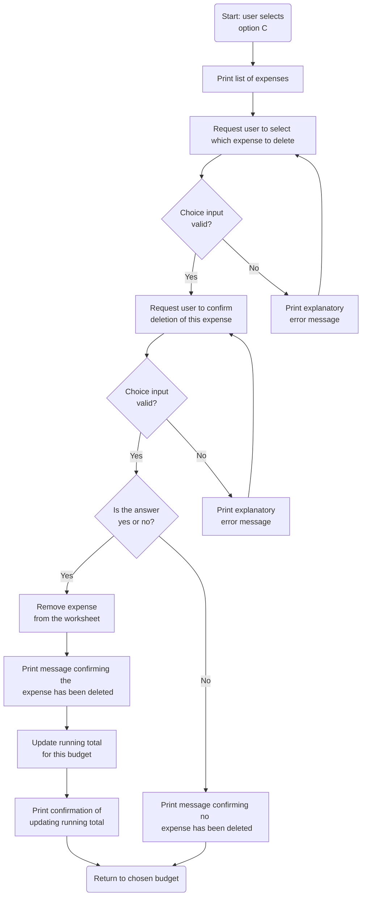

##### Delete Expense Screenshot
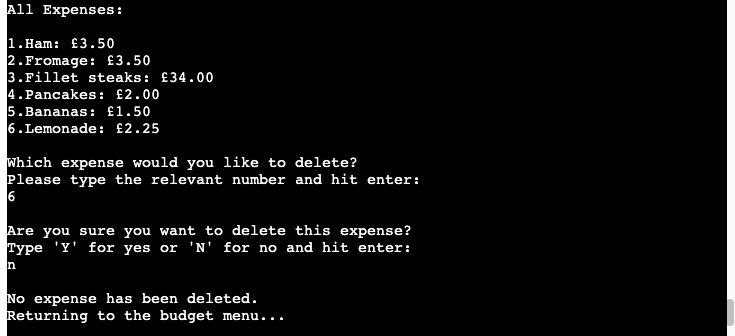

---

### Reports Menu and Outputs
The report menu is accessed from option 5 when the app is run. All three reports are printed from the report menu. As these are simpler, I have put them all into a single flowchart.

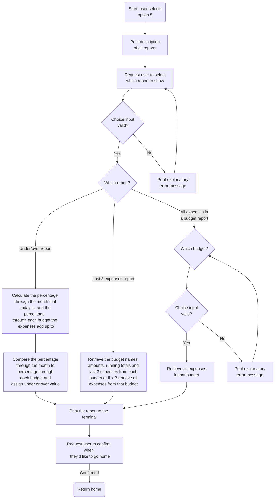
#### Report Menu Screenshot
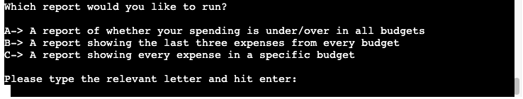

#### Under/Over Report Screenshot
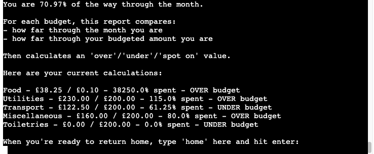

#### Last Three Expenses Report Screenshots
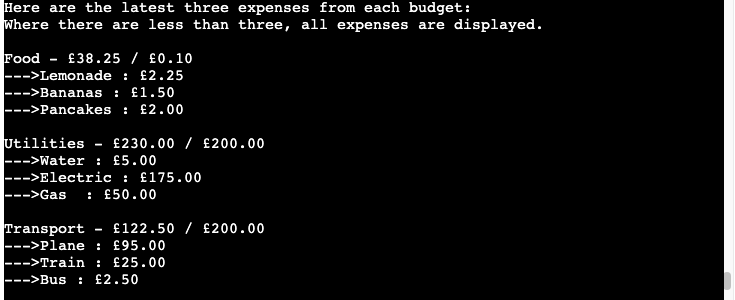

#### All Expenses Report Screenshot
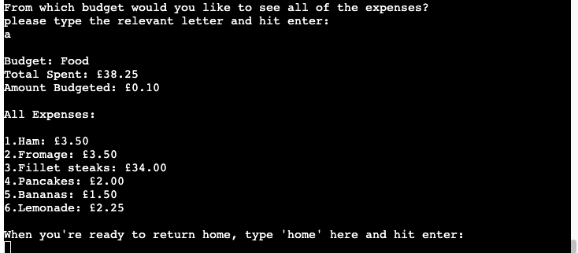

---

### Future Features
Planned enhancements/features for future implementation go here. 

- Changing the architecture to allow the budget name to be validated before asking the user for the amount they wish to allocate to it, when creating a new budget. 
- Reporting that shows the user trends in their spending over time, rather than just a monthly view.
- Adding the ability to do more accurate leap year reporting. At the moment it'll be slightly off because February is always set to 28 days regardless of whether it is a leap year.
- Adding graphs for all the reports.
- Styling the front end part in Heroku, around the terminal window as an added bonus to make it more attractive.
- Letting the user select the currency type rather than defaulting to GBP

## Testing

I took a test-as-you-go approach - testing after each change to ensure that my desired outcome was achieved. 

I also completed an end-to-end test covering these aspects, at milestones throughout the project:

- Test each user journey from start to finish
- Test going home from every input possible
- Test every input with invalid inputs, empty inputs and extreme values (where applicable)
- Test all reports with no values in the spreadsheet, as well as lots of values in the spreadsheet

## Code Validation
PEP8 validation using the Code Institute Python Linter was completed at milestones throughout the project and once right at the end. All errors given were resolved each time. 

## Resolved Bugs

### Bug One

#### Issue:
- About halfway through the project, I realised that the validation I had used for alphanumeric (`isalphnum`) values and numeric values (`isnumeric`) wouldn't work because I needed to allow spaces on the former and dots on the latter, e.g. 'Sausage Roll' could be an expense but would not be allowed with alphanumeric validation and it could cost '1.50' but this would not be allowed with numeric validation. 

#### Solution: 

1. Alphanumeric validation: in considering this issue, I realised that my app should not care what a user wants to call their expenses or budgets. Perhaps they have a categorising system that includes punctuation, for example. I simply removed this validation and allowed users to call their expenses and budgets anything they like. 
2. Numeric validation: I changed this from using `isnumeric` to trying to cast the string input to a float. An input is invalid if it fails to cast. This is done inside a `while` loop that retries a `try: except: else:` block until a valid input is given.

### Bug Two

#### Issue: 
- I realised that even after I was adding expenses to my Google sheet as a float rather than as a string (see solution of bug one above), I was still printing costs as '£1.5' rather than '£1.50' within the 'new expense' or 'editing an existing expense' functions. I had not formatted the float correctly to give the two decimal places that is the standard formatting of currency.

#### Solution: 
- I formatted the number before passing it to be printed to the terminal. I used this format string `{:.2f}`

### Bug Three 

#### Issue: 
- Each time I validated whether the letter the user has entered corresponds to a worksheet in my Google sheet, I got an incorrect 'valid' response for one letter of the alphabet beyond those available as valid responses. This meant that my app was asking the API for a worksheet that did not exist and therefore resulted in an exception. 

#### Why?
- I was checking whether the index of that letter in the letters list: `letters = string.ascii_uppercase` was greater than the length of the list of worksheets in my Google sheet. So if there are budgets A, B, C, D and E, these are at indexes 0-4 in this letters list. In my list of all worksheets in the Google sheet, these budgets are at the same indexes. The issue is that if the user entered 'F' in this scenario, that would be an index of 5 and would be compared to the number of worksheets, which is also 5 and give a valid result. This is wrong and resulted in the exception. 

#### Solution:
- I changed the validation to check whether the user-inputted letter was greater than or equal to the length of all worksheets. I added the 'equal to' part to cover this scenario. 

### Bug Four 

#### Issue:
- It was possible for a user to add an incomplete new budget (new worksheet in the Google sheet) by partially completing the new budget process that the new_budget function leads them through, then opting to go home by typing 'home' in an input. 

#### Solution:
- I found that this was because I was adding the information in stages throughout that function, rather than in one big chunk at the end when all the data needed for a complete budget was present. I moved all of the writing of data to the Google sheet to the end of the function all together. 

### Bug Five 

#### Issue: 
- When editing the amount allocated to a newly created budget, it did not format the number correctly, omitting the '.00' expected at the end. This is the format that is used everywhere else and the bug did not occur with budgets I had previously manually interacted with on the Google Sheet. The user would of course not have access to the Google Sheet so this needed resolving. 

 - Example:  
    On budget creation: G-> Cosmetics: £0.00 / £150.00 
    On budget edit (bug): G-> Cosmetics: £0 / £150 
    On budget edit (bug resolved): G-> Cosmetics: £0.00 / £150.00

#### Solution:
- I found out how to format the cell that the newly created budget's allocated amount went into on creation of the new worksheet dedicated to that budget. I did this using the gspread documentation. 

- I used the appropriate formatting so that any future number received by that cell would retain the correct formatting. I added this line in and it solved the issue:`current_budget_worksheet.format("B:B", { "numberFormat": { "type":"NUMBER", "pattern":"#####0.00" }})`

### Bug Six

#### Issue: 
- During testing I found that sometimes putting a lower case 'n' or 'a' in one of the 'Name or Amount' choices when editing a budget or an expense, didn't work. The entry was not recognised as a valid option. 

#### Solution: 
- I found that this was because I was transforming the user input with `.upper()`, the first time the app asked for the name or amount. But I was not doing this on subsequent requests for this information AFTER the user had entered an invalid input. I moved the location of the `.upper()` so it catches both new inputs and inputs after an invalid input. 

### Bug Seven

#### Issue: 
- It was possible to delete the amount budgeted from a budget's worksheet when typing '0' as the input when asked which number expense you want to delete. 

#### Solution: 
- When I was validating that the number the user inputs when asked which expense they want to delete is an available option, I only accounted for if the user put in a number higher than the highest available expense. This had the effect of deleting the amount budgeted row on my worksheet when the user enters '0', as this is the data directly above the expense rows on each budget's worksheet. I added validation for too low a number as well now, so this has been resolved.

### Bug Eight

#### Issue: 
- After an expense action is taken, instead of taking the user back to the main menu, the app takes the user to the expense action menu for the same budget they had originally chosen. I had accounted for when there were no expenses in a budget, the expense action menu would not ask the user whether they wanted to edit or delete an expense and took them directly to adding an expense. However this was only when they freshly came from the main menu - what I didn't account for was when a budget with a single expense in it, had that single expense deleted. This still took the user back to the expense action menu and asked them whether they wanted to add, edit or delete an expense. 

#### Solution: 
- I amended all expense actions so that they return to the part of the menu where the user is asked to select which budget they would like to add, edit or delete an expense in. By going back one step further, the system will retrigger the checks for whether any expense exists and not offer the option of editing or deleting an expense in a budget that doesn't have any expenses in it. I also added a print out of the budget list again on subsequent visits to the budget choice menu because the list of budgets is going to be a lot further back. So instead of requiring a lot of scrolling, I just print the list afresh for them to choose from. 

### Bug Nine

#### Issue: 
- Despite formatting the column that holds all the numbers to float format with 2 decimal places when creating a new worksheet/budget, the formatting was not persisting throughout the application. Sometimes I did not get the decimal places. 

#### Solution: 
- Firstly, I tweaked the formatting to set the `value_input_option` to be user entered by adding the `raw` boolean set to false, as per the gspread documentation. Then, to ensure all my bases are covered, I also added casting to float to my `cell_update` API call inside `access_data()` in the format of a `try: except` statement so that the numbers are converted and it doesn't raise an unhandled exception when the words are not. This is because the cell update API call handles both words and numbers. Finally, I also realised that by adding `{.2f}` to my new row holding my new expense data, I was negating the casting to float I had done, by turning it back into a string with the use of this string format modifier. 

### Unresolved Bugs

I don't believe I have left any of my bugs unresolved. 

## Deployment

This project was deployed to [Heroku](https://id.heroku.com/login): a hosting platform and is accessible via the mock terminal displayed on the [dedicated app page here](https://cashflow-companion-df3e84b2af73.herokuapp.com/). 

These are the steps I took to set up my infrastructure and deploy my app:

1. Created a blank [Google Sheet](https://docs.google.com/spreadsheets/create) to store my data with the name 'cashflow_companion'.
2. Created a new project on the [Google Cloud Platform](https://console.cloud.google.com/) by clicking 'New Project' from the project selection dropdown in the top menu bar.
3. Navigated to the Cashflow Companion project page and clicked on 'APIs & Services' in the left hand burger menu. 
4. From here I enabled the 'Google Drive API' and navigated to the 'Credentials' section. I set the API being used as the 'Google Drive API' and the type of data I'll be accessing to 'Application Data'. I answered 'No' to the question asking me if I would be using one or more of a specific set of other services.
5. Next I set up the Service Account details with a name and the editor role, leaving everything else blank.
6. When this was created I clicked on the service account on the next page, and the 'Keys' tab, where I created a new JSON key file which I downloaded to my computer.
7. Next, I enabled the Google Sheets API. This was just a case of searching for this API on from the 'APIs & Services' page and clicking 'Enable'. Nothing further was required.
8. I created a new repository on my GitHub from the [Code Institute template](https://github.com/Code-Institute-Org/p3-template) and named it 'cashflow-companion'.
9. I opened this repo on my IDE and uploaded the JSON key file from earlier, renaming it 'creds.json'. This was then added to the gitignore file so that the credentials are not sent to GitHub.
10. The service account details from the creds.json file, listed as 'client_email' were added to the Google Sheet as a user to enable the app to read and write data from and to it. 
11. On Heroku, in the settings, a config var named 'CREDS' was created and the contents of the creds.json file were added to the value field, to enable Heroku to access the app. 
12. I added another config var called 'PORT' set to '8000' here too. 
13. Further dependencies required outside of those in the requirements.txt file found in my repository, were added via buildpacks on Heroku, again found in the settings. Firstly, 'python' and then 'nodejs' in that order.
14. Next I clicked on the 'Deploy' tab and connected my github repository code to the Heroku app. I clicked 'Enable Automatic Deploys' and Heroku deployed the app for me. Once this was done, the link to the app appeared and could be clicked to go to the deployed app.

## Credits

### APIs and Third Party Libraries
1. [Google Sheets API: 'gspread'](https://docs.gspread.org/en/v6.0.0/) - This was installed to provide access to the associated spreadsheet which will hold all the data for Cashflow Companion.
2. [String Module: 'string'](https://docs.python.org/3/library/string.html) - This was installed to assist me with letter input validation and selection of menu options and therefore data retrieval. 
3. [Date/Time Module: 'datetime'](https://docs.python.org/3/library/datetime.html) - This was installed to provide dates to work with for report A. This report figures out whether you are under or over budget based on the percentage through the month it is and the percentage through your budget you are.

### Sources of Learning
I referred back to the Love Sandwiches Walkthrough Project set up videos to remind me how to set up the APIs, credentials and files before starting coding.

- I built my flowcharts using [Mermaid](https://mermaid.js.org/syntax/flowchart.html) in my readme.
- I learnt how to increment letters on [Geeks for Geeks](https://www.geeksforgeeks.org/ways-increment-character-python/) 
- I learnt how to check if the user's input is alphanumeric on [W3 Schools](https://www.w3schools.com/python/ref_string_isalnum.asp). This was used in early versions.
- I learnt how to check if the user's input is numeric on [W3 Schools](https://www.w3schools.com/python/ref_string_isnumeric.asp#:~:text=The%20isnumeric()%20method%20returns,considered%20to%20be%20numeric%20values). This was used in earlier versions
- I learnt how to get the trailing zero on my expense and budget amounts on [Stack Overflow](https://stackoverflow.com/questions/455612/limiting-floats-to-two-decimal-points) and [W3 Schools](https://www.w3schools.com/python/python_string_formatting.asp)
- I learnt about using dates in Python on [W3 Schools](https://www.w3schools.com/python/python_datetime.asp).
- I learnt how to split one line of code across multiple for line length PEP8 purposes on [Geeks for Geeks](https://www.geeksforgeeks.org/python-multi-line-statements/).

### General Credit
As ever, I want to thank the open source community for the great resources that teach me so much and also remind me of what I learnt in my Code Institute lessons. 

I believe I have specifically credited where I used specific items in the previous section but this is a general credit to the reference resources I looked through to teach me new elements as well as reminding me how things I'd already come across worked as I went along. 

Every effort has been made to credit everything used, but if I find anything else specific later on that needs crediting, that I missed, I will be sure to add it. 

### Retrospective
I learnt a lot during this project and this can be seen over the course of the iterative improvements made, viewable via my commit history. Two examples were: 

1. Refactoring to reduce API calls: I had gotten into a situation where I was making so many API calls to retrieve information cell by cell, that I was frequently triggering 429 quota exceeded errors from the Google Sheet API. I had to reduce this to make my app more usable and drastically reduce the possibility of 429 errors. To do this, I switched to bulk data retrieval that was stored in a variable, then I was able to take the parts out of it that were relevant to the task at hand. One example of where I did this was in the welcome messaging - I was getting the budget name, the running total for that budget and the amount budgeted individually for each budget. With five budgets to display the information for that turned out to be 15 calls. The result of my refactoring in this way was that I reduced the calls for that section from 15 to 1.

2. Refactoring to reduce repetition: I was repeating the same actions when doing things like accessing data, validating budget choices, getting budgets and their details, and printing expenses. These could be found in various functions, written out in full inside each one. I refactored to strip this repetition and created central functions that could be called to perform the desired actions, then return the required information. 
