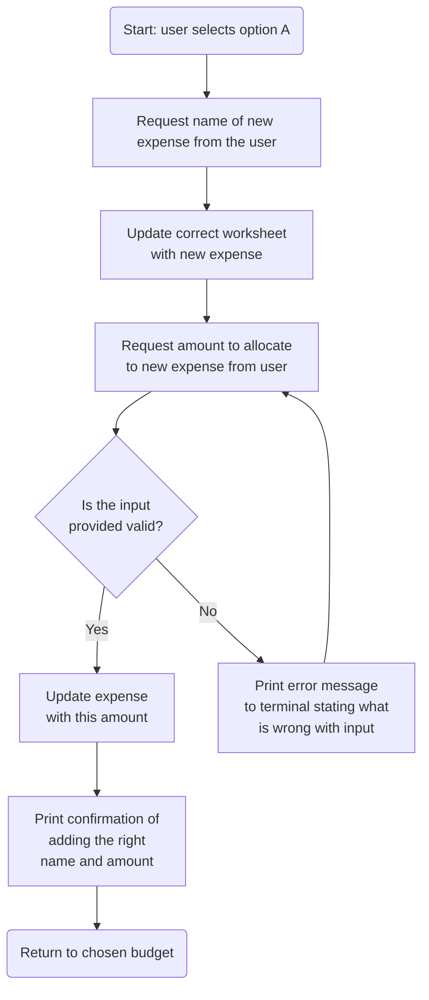
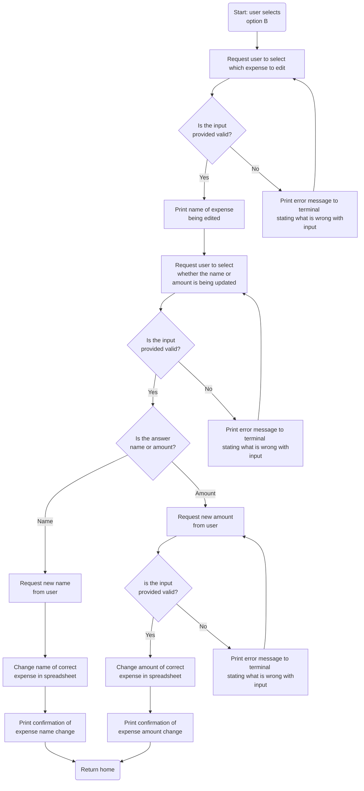
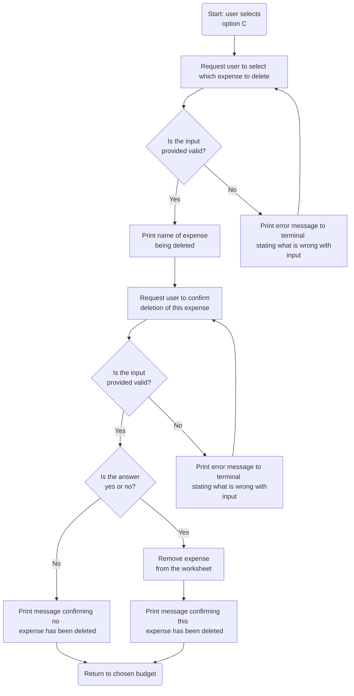

# Cashflow Companion: a budgeting app

'Cashflow Companion' is a command-line-interface (CLI) budgeting app hosted as an app on Heroku, written in Python.

## Purpose 
The objective of this app is to provide the user with a means to set up a personalised monthly budget with their own categories, budget amounts and expense entries. It will provide a useful report to show the user how their expenditure is tracking over the month, informed by how much of their budget they've spent and how far through the month they are.

## Requirement Gathering and Planning

Before starting the coding for this project, I took the time to think about how to set up the architecture of this app, the layout of the output on the console and the functionality required to provide a good user experience. 

### User Demographics, Stories and Needs

#### Target Demographic
This app is useful for anyone wanting to track and control their finances regardless of age, income or profession. Some examples of such people are: 

- Students: this group of people tend to be younger, have a smaller budget and just starting to manage their own finances. Keeping track to avoid overspending would be useful to them.
- Families: multiple adults working from a single budget with a wide variety of expenses including childcare, may need to keep a close eye on their finances to ensure that their outgoings don't exceed their income.
- Debt repayers: people who are trying to actively reduce their debt such as student loans or credit card debts, benefit from the use of this app because they can manage their spending to ensure they have enough for a payment against their debt at the end of the month.

#### User Stories

There were quite a few user stories for this app so to make them more readable and avoid repetition, I have compiled them in the table below. 

|As a budget app user, I want to... | So that... |
|--------|--------|
| ...create budgets and assign them amounts. | ...I can personalise what types of expenses I'm tracking and how much I've got set aside for each budget. |
| ...see which budgets I have and the amounts assigned to them. | ...I am reminded of how much I can spend in any given budget.|
| ...change the budgets and/or amounts allocated to them. | ...my budgeting is flexible should my circumstances or priorities change. |
| ...delete a budget. | ...I can remove any budget that is no longer relevant to my budgeting activities. |
| ...add new expenses. | ...I can keep track of all of them against my budget for each budget. |
| ...update the name and amount of an existing expense. | ...I can correct any typos or update the cost if it changes. |
| ...delete expenses from any budget. | ...I can keep my outgoings figures correct in the case of a return or refund. |
| ...read all expenses in a budget. | ...I can review my expenses for this month in any given budget. |
| ...read the last 3 expenses for each budget. | ...I can review my recent purchases across all budgets. |
| ...get a summary of all expenses. | ...I can see the full picture of all my expenses for the month. |
| ...get a report for my overall spending indicating the budgets that are under/over budget. | ...I know whether I am on track to meet my budget goals this month. |
|...have the option of going to the start of the program from wherever I am. | ...I have freedom to navigate elsewhere if I decide to abandon an action or if I accidentally select the wrong option. |
| ...have the option of going back one step wherever I am. | ...I have freedom to navigate back if I've accidentally chosen the wrong option or changed my mind. |
| ...have a clear and intuitive method of navigating through the app via the command line. | ...I can easily navigate and use the app. |

### Process Flowchart 

I created this flowchart to think about the various paths through the app from the command line and what the user journeys would look like. Please open the chart full width or use the zoom function in Git Hub to see the information.

There are two more details regarding the user journeys that I have omitted from the flowchart so as not to crowd it and make it illegible: 
- At the end of each journey the user will be automatically returned home(to the start of the flowchart), apart from on the expense arm of the flowchart where the user will be returned to the budget they are currently working in. 
- At each stage the user will also have the option to go back one level/question or go home. 

### Data Model
Google Sheets will be used to store the data between sessions so that it is not lost. Within the Google Sheet: 

- One worksheet will be one budget - e.g.'Food'
- In each budget worksheet
    - The top row will have the budget amount - e.g. 'Amount Budgeted: £400'
    - The second row will have the running total for the expenses on that worksheet - e.g. 'Running Total: £250'
    - The third row onwards will be expenses, one expense per row - e.g. 'Eggs: £2'

In the app the following structures will be used: 

| Data Type | Structure |
|-------|------|
| Budget names and allocated amounts | Dictionaries |
| Running totals | Dictionaries |
| Expenses | Dictionaries |
| All budgets with their amounts | List of dictionaries |
| All expenses | List of dictionaries |

## Design

### Wireframes
I wrote text-based 'wireframes' to plan what will be in the console for each scenario. These are included in a separate file [here](wireframes.md)

It's also important that enough of the lines I print for each action in the program, fit onto a terminal of 80 characters wide and 24 rows high. Otherwise this could cause user confusion. 

## Features
The features of the app can be grouped into three main areas: 
1. Budgets
2. Expenses
3. Reports

The branches coming off the root of my flowchart above, make up these three main areas. Whereas my process flowchart above is from the perspective of user journeys, the flowcharts below lay out the logic path through the program for each feature, from home to achieving the desired outcome.

The 'read' element of the CRUD framework is presented automatically to the user at each appropriate moment:
- Budgets are shown as soon as the program is run, then when updating a budget's name or amount allocated, or deleting a budget.
- Budgets, then a specific budget with its expenses are shown when a budget is chosen in the expenses part of the program
- Budgets and expenses are shown in two different ways when the two different reports are run.
- Report descriptions are shown before the user selects which report they'd like to run.

### Budgets
All budget actions can be accessed directly from the first part of the program, selecting options 1, 2 or 3.

#### Create a budget 
This is option one when the program is run. 

#### Update a budget
This is option two when the program is run. 

#### Delete a budget
This is option three when the program is run. 

### Expenses
All expense actions are accessed from option 4 when the program is run. The user is first asked which budget they want to access for expense purposes, then are given the options A - to add an expense, B - to edit an expense and C - to delete an expense.

#### Add an expense
This is option A after a budget has been chosen in the expenses menu.

#### Edit an expense
This is option B after a budget has been chosen in the expenses menu.

#### Delete an expense
This is option C after a budget has been chosen in the expenses menu.

### Reports
Both reports are accessed from option 5 when the program is run. 

### Future Features
Planned enhancements/features for future implementation go here. 

- Reporting that shows the user trends in their spending over time, rather than just a monthly view.
- Adding graphs for all the reports.
- Styling the front end part in Heroku, around the terminal window as an added bonus to make it more attractive.
- Letting the user select the currency type rather than defaulting to GBP

## Testing
- Test each user journey from start to finish
- Test going home from every input possible
- Test every input with invalid inputs, empty inputs and extreme values (where applicable)
- Test both reports with no values in the spreadsheet, as well as lots of values in the spreadsheet

## Code Validation
PEP8 validation using the Python Linter

## Resolved Bugs

### Bug One:

#### Issue:
About halfway through the project, I realised that the validation I had used for alphanumeric (`isalphnum`) values and numeric values (`isnumeric`) wouldn't work because I needed to allow spaces on the former and dots on the latter, e.g. 'Sausage Roll' could be an expense but would not be allowed with alphanumeric validation and it could cost '1.50' but this would not be allowed with numeric validation. 

#### Solution: 

1. Alphanumeric validation: in considering this issue, I realised that my program should not care what a user wants to call their expenses or budgets. Perhaps they have a categorising system that includes punctuation, for example. I simply removed this validation and allowed users to call their expenses and budgets anything they like. 
2. Numeric validation: I changed this from using `isnumeric` to trying to cast the string input to a float. An input is invalid if it fails to cast. This is done inside a `while` loop that retries a `try: except: else:` block until a valid input is given.

### Bug Two: 

#### Issue: 
I realised that even after I was adding expenses to my Google sheet as a float rather than as a string (see solution of bug one above), I was still printing costs as '£1.5' rather than '£1.50' when reading them back for whatever function in the program. 

#### Solution: 

### Unresolved Bugs

I don't believe I have left any of my bugs unresolved. 

## Deployment
Explain how this app was deployed so that a non-technical user could do it. How to deploy the app to heroku including any necessary config files or environment variables.

## Credits

### APIs and Third Party Libraries
Google Sheets API: 'gspread' - This was installed to provide access to the associated spreadsheet which will hold all the data for Cashflow Companion.

### Sources of Learning
I referred back to the Love Sandwiches Walkthrough Project set up videos to remind me how to set up the APIs, credentials and files before starting coding.

To build my flowchart using Mermaid in my readme: https://mermaid.js.org/syntax/flowchart.html
I learnt how to increment letters here: https://www.geeksforgeeks.org/ways-increment-character-python/
I learnt how to check if the user's input is alphanumeric here: https://www.w3schools.com/python/ref_string_isalnum.asp
I learnt how to check if the user's input is numeric here: https://www.w3schools.com/python/ref_string_isnumeric.asp#:~:text=The%20isnumeric()%20method%20returns,considered%20to%20be%20numeric%20values.

### General Credit
As ever, I want to thank the open source community for the great resources that teach me so much and also remind me of what I learnt in my Code Institute lessons, especially 

I believe I have specifically credited where I used specific items in the previous section but this is a general credit to the reference resources I looked through to remind me how things worked as I went along. 

Every effort has been made to credit everything used, but if I find anything else specific later on that needs crediting, that I missed, I will be sure to add it. 

-------------------------------------------------------------------------

Welcome,

This is the Code Institute student template for deploying your third portfolio project, the Python command-line project. The last update to this file was: **March 14, 2023**

## Reminders

- Your code must be placed in the `run.py` file
- Your dependencies must be placed in the `requirements.txt` file
- Do not edit any of the other files or your code may not deploy properly

## Creating the Heroku app

When you create the app, you will need to add two buildpacks from the _Settings_ tab. The ordering is as follows:

1. `heroku/python`
2. `heroku/nodejs`

You must then create a _Config Var_ called `PORT`. Set this to `8000`

If you have credentials, such as in the Love Sandwiches project, you must create another _Config Var_ called `CREDS` and paste the JSON into the value field.

Connect your GitHub repository and deploy as normal.

## Constraints

The deployment terminal is set to 80 columns by 24 rows. That means that each line of text needs to be 80 characters or less otherwise it will be wrapped onto a second line.

---

Happy coding!
